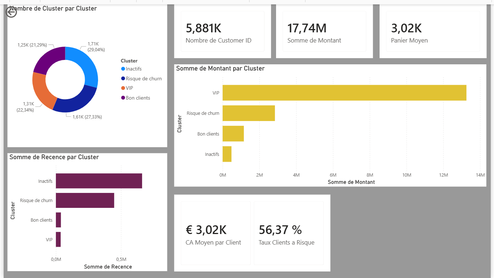

# 📈 Segmentation Client & Dashboard Décisionnel - Machine Learning (K-Means) & Power BI

## 🎯 Objectif du Projet
L'objectif de ce projet est de segmenter une base de données clients afin d'identifier les différents profils d'acheteurs (VIP, Bons clients, Risque de Churn, Inactifs) et de fournir un outil de pilotage interactif et visuel pour orienter les stratégies marketing.

---

## 📊 Le Dashboard Décisionnel (Power BI)
L'interface a été développée en mode sombre pour offrir un rendu moderne et professionnel ("Application Tech") :

### 💡 Fonctionnalités clés :
- **Interactivité totale :** En cliquant sur un segment de l'anneau (ex: les VIP), l'ensemble des indicateurs (CA, panier moyen) et les graphiques s'actualisent instantanément pour ce profil précis.
- **Analyses croisées :** Visualisation de la rentabilité brute (Montant total) mise en opposition avec la perte de vitesse des clients (Récence moyenne).

---

## 🛠️ Stack Technique & Compétences Validées

### 1. Data Science & Machine Learning (Python)
- **Feature Engineering :** Nettoyage et calcul du score **RFM** (Récence, Fréquence, Montant) par client.
- **Clustering Non-Supervisé :** Implémentation de l'algorithme **K-Means** via Scikit-Learn.
- **Optimisation :** Utilisation de la méthode du coude (Elbow Method) pour déterminer le nombre optimal de clusters ($k=4$).

### 2. Business Intelligence & Analytics (Power BI & DAX)
- **Modélisation & Power Query :** Importation du fichier segmenté, correction des types de données et gestion des formats régionaux (conversion des points en virgules pour les décimaux).
- **Développement DAX Avancé :** Création de mesures calculées dynamiques pour enrichir l'analyse :
  - *Panier Moyen* : Calculé dynamiquement selon le contexte de filtrage.
  - *Chiffre d'Affaires Moyen par client*.
  - *Taux de Clients à Risque (%)* : Utilisation des fonctions avancées `CALCULATE`, `DISTINCTCOUNT` et `SEARCH` pour isoler les clusters en attrition.

---

## 🚀 Impact Business
Ce projet permet de passer d'un marketing de masse à une stratégie de ciblage ultra-personnalisée :
- **👑 VIP :** Consolider la relation via des programmes de fidélité exclusifs (segment à fort panier moyen).
- **⚠️ Risque de Churn / 💤 Inactifs :** Déclencher des campagnes de réactivation ciblées (e-mailing, offres spéciales) basées sur leur score de récence élevée pour freiner l'attrition.
